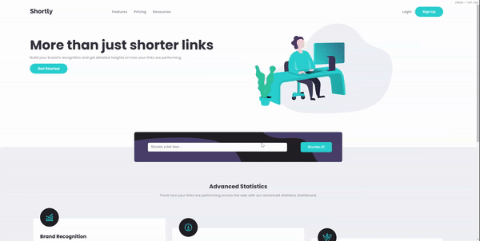

<h1 align="center">Shortly</h1>

<div align="center">

&nbsp;
&nbsp;
&nbsp;
&nbsp;
</div>

This is a solution to the [Shortly URL shortening API Challenge challenge on Frontend Mentor](https://www.frontendmentor.io/challenges/url-shortening-api-landing-page-2ce3ob-G). Frontend Mentor challenges help you improve your coding skills by building realistic projects. 

## Table of contents

- [Overview](#overview)
  - [The challenge](#the-challenge)
  - [Screenshots](#screenshot)
  - [Links](#links)
  - [Project Setup](#project-setup)
- [My process](#my-process)
  - [Built with](#built-with)
  - [What I learned](#what-i-learned)
  - [Continued development](#continued-development)
  - [Useful resources](#useful-resources)
- [Author](#author)
- [Acknowledgments](#acknowledgments)

## Overview

### The challenge

Users should be able to:

- View the optimal layout for the site depending on their device's screen size
- Shorten any valid URL
- See a list of their shortened links, even after refreshing the browser
- Copy the shortened link to their clipboard in a single click
- Receive an error message when the `form` is submitted if:
  - The `input` field is empty

### Screenshots

<div align="center">
    
    
</div>

### Links

- Solution URL: [GitHub](https://github.com/natalia-sampaio/shortly)
- Live Site URL: [Vercel](https://shortly-lovat.vercel.app/)

### Project Setup

```sh
npm install
```

#### Compile and Hot-Reload for Development

```sh
npm run dev
```

#### Compile and Minify for Production

```sh
npm run build
```

#### Lint with [ESLint](https://eslint.org/)

```sh
npm run lint
```

## My process

### Built with

- Semantic HTML5 markup
- Flexbox
- CSS Grid
- Mobile-first workflow
- Responsive layout
- [Vue.js](https://vuejs.org/) - JS framework

### What I learned

This project was my first contact with Vue.js, I learned about the basics of list rendenring and event handling with Vue.js. 

```html
<template>
    <div class="shorten">
        <div class="shorten-form">
            <div class="shorten-form-box">
                <input v-model="url" type="url" placeholder="Shorten a link here..." 
                aria-label="input for url to be shortened"
                :class="['shorten-form__input', error ? 'error-input' :'']">
                <span v-if="error" class="error-message">Please add a link</span>
            </div>
            <button type="button" class="button button--shorten-form" 
            @click.prevent="shorten">
                <span class="link link--white">Shorten It!</span>
            </button>
        </div>
    </div>
</template>
```

### Continued development

In future projects I want to improve the usage of Vue.js, especially about best practices with this framework.

### Useful resources

- [Frontend Mentor](https://www.frontendmentor.io/) - This helped me to find simple and well defined projects that I can use to learn new technologies while creating beautiful projects.
- [Vue.js Doc](https://vuejs.org/guide/introduction.html) - The Vue.js documentation is very easy to read and it helped me a lot with my first steps.

## Author

<a href="natalia.srsa@proton.me"></a>

<a href="https://www.linkedin.com/in/natalia-srs/"></a>

<a href="https://twitter.com/NataliaSRSA"></a>

## Acknowledgments

My husband [@filipedanielski](https://twitter.com/filipedanielski) who is always supporting and encouraging me.


